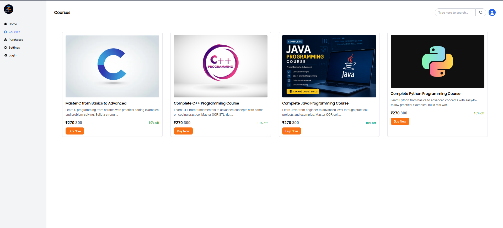
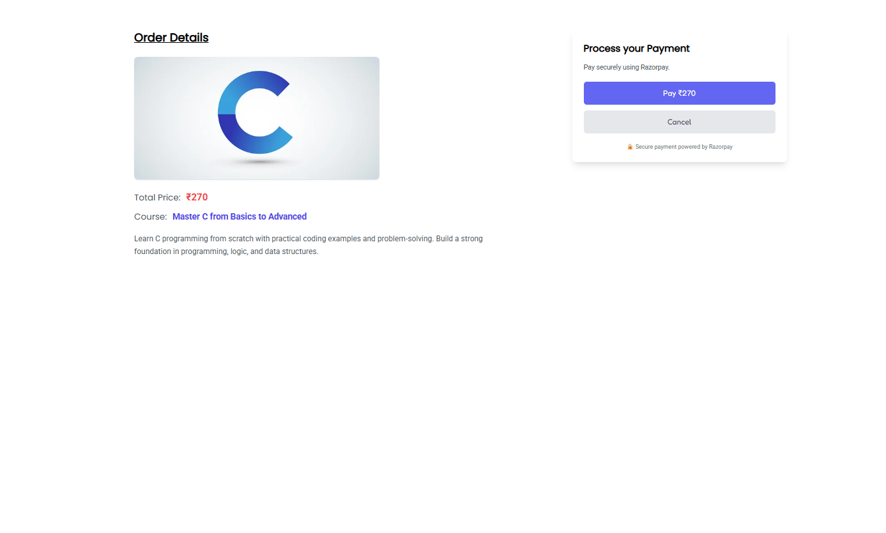
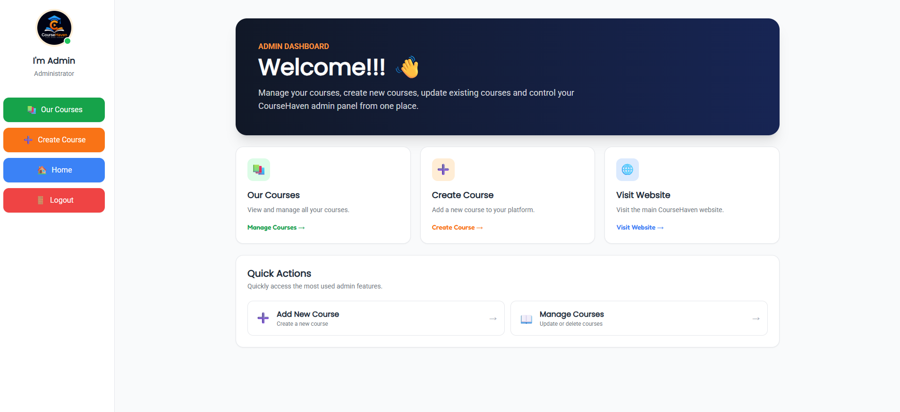

# 🎓 Course Selling Platform

A full-stack **MERN application** for selling and managing online courses.

The platform allows users to register, log in, browse available courses, purchase courses securely using Razorpay, and view their purchased courses. It also includes a separate admin panel for managing courses.

---

## 🚀 Features

### 👤 User Features

- User Signup and Login
- JWT Authentication
- Protected Routes
- Browse Available Courses
- Purchase Courses
- Razorpay Payment Integration
- Secure Payment Verification
- View Purchased Courses
- Secure API Communication

### 🛠️ Admin Features

- Admin Signup and Login
- Admin Dashboard
- Create New Courses
- Update Existing Courses
- View and Manage Courses
- Protected Admin Routes
- Role-based Access Control

---

## 🧰 Tech Stack

### Frontend

- React.js
- Vite
- Tailwind CSS
- Axios

### Backend

- Node.js
- Express.js
- JWT Authentication
- REST APIs
- Razorpay

### Database

- MongoDB
- Mongoose

---

## 📁 Project Structure

```text
courseapp/
│
├── backend/
│   ├── controllers/
│   ├── middlewares/
│   ├── models/
│   ├── routes/
│   ├── config.js
│   ├── index.js
│   ├── package.json
│   └── .env
│
├── frontend/
│   ├── public/
│   │   └── _redirects
│   │
│   ├── src/
│   │   ├── admin/
│   │   │   ├── AdminLogin.jsx
│   │   │   ├── AdminSignup.jsx
│   │   │   ├── CourseCreate.jsx
│   │   │   ├── Dashboard.jsx
│   │   │   ├── OurCourses.jsx
│   │   │   └── UpdateCourse.jsx
│   │   │
│   │   ├── components/
│   │   │   ├── Buy.jsx
│   │   │   ├── Courses.jsx
│   │   │   ├── Home.jsx
│   │   │   ├── Login.jsx
│   │   │   ├── Purchases.jsx
│   │   │   └── Signup.jsx
│   │   │
│   │   ├── assets/
│   │   │   ├── logo.png
│   │   │   └── react.svg
│   │   │
│   │   ├── utils/
│   │   │   └── utils.js
│   │   │
│   │   ├── App.css
│   │   ├── App.jsx
│   │   ├── index.css
│   │   └── main.jsx
│   │
│   ├── package.json
│   └── .env
│
├── screenshots/
│   ├── admin-dashboard.png
│   ├── courses.png
│   ├── create-course.png
│   ├── home.png
│   ├── login.png
│   ├── manage-courses.png
│   └── payment.png
│
├── .gitignore
└── README.md
```

---

## 🔐 Authentication & Authorization

The application uses **JWT (JSON Web Tokens)** for authentication and authorization.

Features include:

- User Authentication
- Admin Authentication
- Protected User Routes
- Protected Admin Routes
- Middleware-based Authorization
- Role-based Access Control

---

## 💳 Payment Integration

The application integrates **Razorpay** for secure course payments.

### Payment Flow

1. User selects a course.
2. Frontend sends a request to create a Razorpay order.
3. Backend creates the Razorpay order.
4. Razorpay Checkout opens for payment.
5. After successful payment, Razorpay returns payment details.
6. Backend verifies the Razorpay payment signature.
7. The order is saved.
8. The purchased course is added to the user's purchases.

---

## ⚙️ Installation and Setup

### 1. Clone the Repository

```bash
git clone https://github.com/SurajPatil-Tech/course-selling-app.git
```

Move into the project folder:

```bash
cd course-selling-app
```

---

## 🔧 Backend Setup

Move into the backend folder:

```bash
cd backend
```

Install dependencies:

```bash
npm install
```

Create a `.env` file and add your environment variables:

```env
MONGO_URL=your_mongodb_connection_string
JWT_SECRET=your_jwt_secret
RAZORPAY_KEY_ID=your_razorpay_key_id
RAZORPAY_KEY_SECRET=your_razorpay_key_secret
FRONTEND_URL=http://localhost:5173
```

Start the backend server:

```bash
npm start
```

Or, if your project supports development mode:

```bash
npm run dev
```

---

## 💻 Frontend Setup

Open another terminal and move into the frontend folder:

```bash
cd frontend
```

Install dependencies:

```bash
npm install
```

Create a `.env` file if required:

```env
VITE_API_URL=http://localhost:3000
VITE_RAZORPAY_KEY_ID=your_razorpay_key_id
```

Start the frontend:

```bash
npm run dev
```

The application will run at:

```text
http://localhost:5173
```

---

## 🌐 Deployment

The application is deployed using **Render**.

- Frontend and backend are deployed separately.
- MongoDB is used as the database.
- Environment variables are configured securely.
- Razorpay is used for course payments.
- CORS supports both localhost development and the deployed frontend.

### Production URLs

**Frontend:**

https://course-selling-app-frontend-yg7b.onrender.com

**Backend:**

https://course-selling-app-backend-uv1d.onrender.com

---

## 🔄 Application & Payment Flow

```text
React Frontend
      │
      ▼
Express.js Backend
      │
      ├──────────────► MongoDB
      │
      └──────────────► Razorpay
                           │
                           ▼
                     Payment Success
                           │
                           ▼
                  Signature Verification
                           │
                           ▼
                      Order Saved
                           │
                           ▼
                  Course Purchase Saved
```

---

## 📌 Key Concepts Used

- MERN Stack Development
- RESTful API Development
- MVC-style Project Structure
- JWT Authentication
- Middleware
- Role-based Authorization
- CRUD Operations
- MongoDB and Mongoose
- React Components
- Protected Routes
- Full-Stack API Integration
- Razorpay Payment Integration
- Payment Signature Verification
- CORS Configuration
- Environment Variables
- Production Deployment

---

## 📸 Project Screenshots

### 🏠 Home Page


### 📚 Courses Page



### 🔐 User Login


### 💳 Course Payment



### 👨‍💼 Admin Dashboard



### ➕ Create Course


### 📋 Manage Courses


---

## 🔒 Environment Variables

Make sure you do **not** upload your `.env` files to GitHub.

Your `.gitignore` should include:

```gitignore
node_modules
.env
dist
```

Never expose:

- MongoDB connection strings
- JWT secrets
- Razorpay Key Secret
- API secrets
- Database credentials

---

## 👨‍💻 Author

**Suraj Patil**

MERN Stack Developer

React.js | Node.js | Express.js | MongoDB

GitHub: https://github.com/SurajPatil-Tech

LinkedIn: https://www.linkedin.com/in/surajpatil-tech